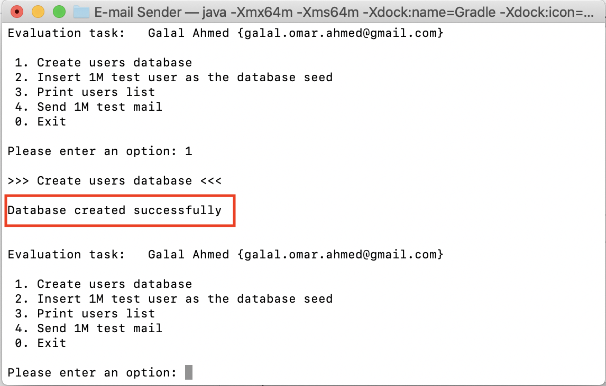
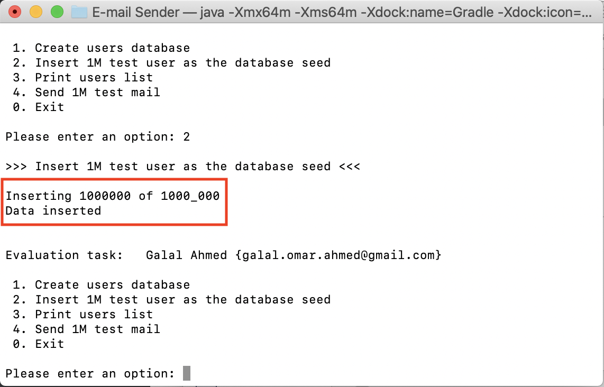
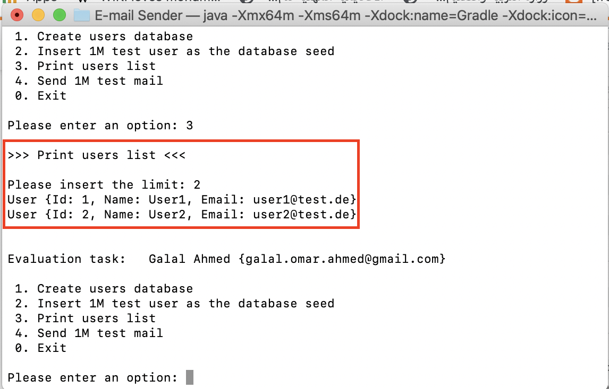
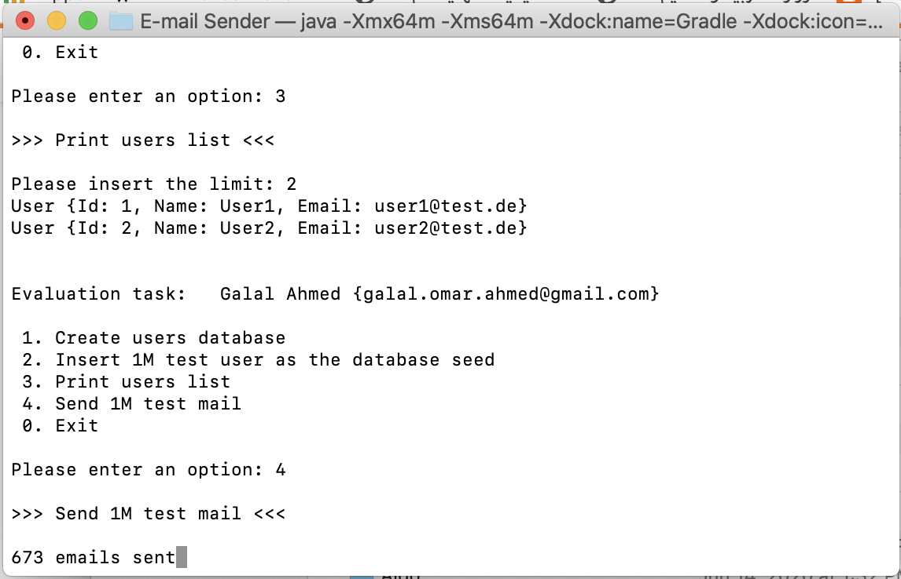

# EmailSenderSimulator
## Using h2 database and java thread
Simple App that uses h2 database to store 1 Million test user.
It uses java threads to get partitions of users and simulte sending email by waiting for half second.

The size of the partition (page size) is calcualated based on the number of thread created as following:
```java
int pageSize = (int) Math.ceil(1000_000/(double)totalNumberOfTasks);
```

The number of threads is calculated based on the number of processors in the runtime enviroment as following:
```java
int totalNumberOfTasks = Runtime.getRuntime().availableProcessors() * 10;
```
###To run the App from termainl:
* cd {Your project directoty}
* ./gradlew clean
* ./gradlew build
* ./gradlew run --console=plain


###### Commands
1- Create the database

2- Insert 1M test user

3- print subset of the user by inserting the limit

4- Simulate sending emails



